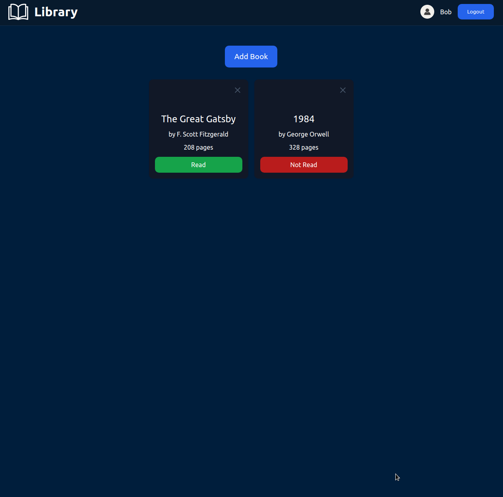

    <h1>Library
     
        
        
        
         
    </h1>
    <h3><b><a href="https://ccolds.github.io/library">View Live Demo</a></b></h3>

# Features

- Add book
- Remove Book
- Read book functionality
- Create a book with title, author, pages, and read
- Store books with Firebase

# Built with

- HTML
- CSS
- JavaScript
- Webpack
- Firebase

# Description

A library app. You can create, delete, and read books.

# What I learned

- Object constructors
- Prototypes and prototypal inheritance
- "this" keyword
